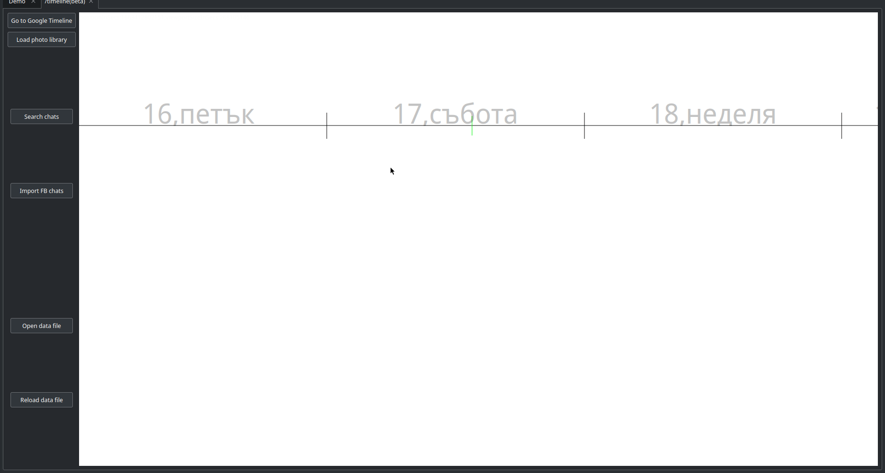

# Misli
An app for note organization with note file hyperlinking, image import, as well as several other types of notes. There is a Timeline journaling component, which allows you to make entries at different time scales and zoom in/out on the timeline.

 **The note-taking functionality is now obsolete** . It's been reimplemented and the app is now called [Pamet](https://github.com/v-ko/pamet). The Timeline will also be ported at some point, but as of now it'll remain here.

## Installation
You can build the app with QtCreator/qmake - use the `misli_desktop.pro`. This version is tested on Linux only but it should be able to run it on windows with minor adjustments.

## Features
---------------------
- Map-like navigation
- Changing note size, position and color
- Multiple note files (called "pages" in the new version)
- Note file hyperlinking (via "link notes")
- Real-time detection of file changes (useful if you're using some type of file synchronization)
- Adding images
- Displaying text files on the file system as notes
- Text search
- Connectiong notes visually with bendable arrows
- Links to web resources
- Exporting note files to HTML
- System command notes (double-clicking them runs e.g. a bash script)
...among other.

## Screenshots

